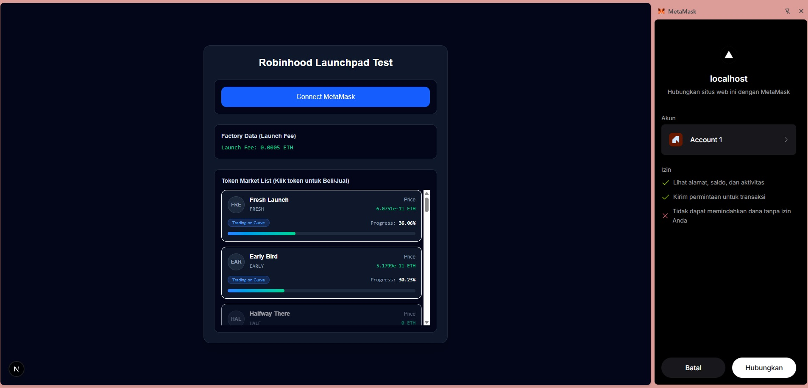
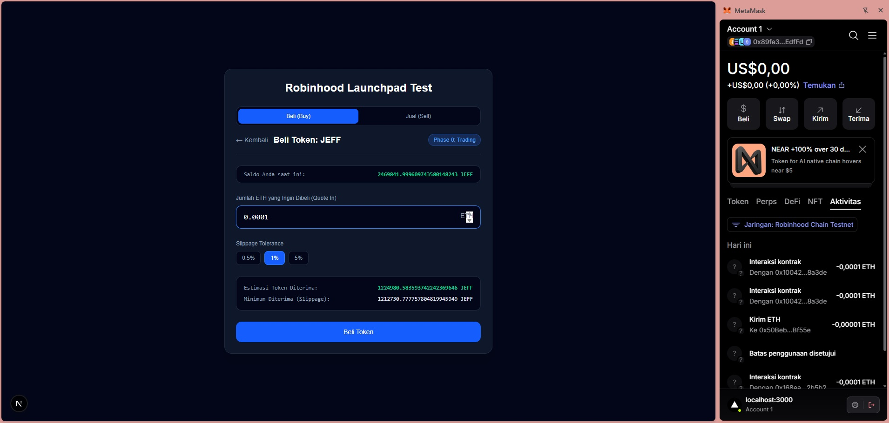

# Launchpad Test

A decentralized Web3 launchpad test application built with **Next.js (App Router)**, **Wagmi/Viem**, and **Tailwind CSS**. It allows users to connect their wallets, view bonding curve token markets, check token progress and prices, and execute buy/sell transactions seamlessly with real-time balance updates.

---

## Project Structure

```text
📦src
 ┣ 📂abi
 ┃ ┣ 📜BondingCurve.json
 ┃ ┣ 📜LauncherToken.json
 ┃ ┗ 📜LaunchFactory.json
 ┣ 📂app
 ┃ ┣ 📜favicon.ico
 ┃ ┣ 📜globals.css
 ┃ ┣ 📜layout.tsx
 ┃ ┣ 📜page.tsx
 ┃ ┗ 📜provider.tsx
 ┣ 📂components
 ┃ ┣ 📜BuyForm.tsx
 ┃ ┗ 📜SellForm.tsx
 ┣ 📂config
 ┃ ┗ 📜chain.ts
 ┗ 📂services
   ┣ 📜getTokenDetails.ts
   ┗ 📜getTokenList.ts
```

## How to Run the Project

Ikuti langkah-langkah berikut untuk menjalankan proyek ini secara lokal:

1. Clone repository ini:

```bash
git clone <repository-url>
cd launchpad-test
```

2. Install dependencies:

```bash
npm install
```

3. Jalankan server development:

```bash
npm run dev
```

4. Buka browser dan akses http://localhost:3000. Pastikan extension dompet Web3 Anda (seperti MetaMask) terhubung ke jaringan uji coba yang sesuai (misalnya Robinhood Chain Testnet).

## Key Technical Decisions & Reasons

- Next.js App Router: Dipilih karena performa server-side/client-side rendering yang cepat dan struktur navigasi file-based routing yang bersih.

- Wagmi & Viem: Digunakan untuk interaksi smart contract (membaca state dan menulis transaksi), manajemen provider koneksi dompet, serta penanganan tipe data BigInt yang aman pada ekosistem EVM.

- Tailwind CSS: Digunakan untuk mempercepat pengembangan antarmuka dengan desain modern bertema gelap (dark mode) yang cocok untuk platform dashboard Web3.

- State Synchronization & Real-time Refetching: Menerapkan pembaruan data otomatis setelah transaksi berhasil (seperti pembaruan saldo ETH dan saldo token pengguna secara instan tanpa perlu refresh halaman).

## What is Unfinished

- Interactive Bonding Curve Charts: Grafik visual garis atau candlestick pergerakan harga token secara real-time belum diimplementasikan dan masih menggunakan data statistik tekstual dasar.

- Token Deployment Wizard UI Form: Antarmuka khusus untuk meluncurkan/membuat token baru melalui LaunchFactory masih terbatas pada interaksi data dasar dan belum memiliki form wizard kustomisasi metadata yang lengkap.

## Parts AI Helped With

- Debugging & State Flow: AI membantu menyusun struktur asinkron pada hooks Viem/Wagmi serta mengoptimalkan fungsi callback saat transaksi berhasil agar komponen UI secara otomatis melakukan refetch data saldo dan progres token.

- UI Component Styling: Membantu menyusun komposisi kelas Tailwind CSS untuk komponen form beli/jual (BuyForm.tsx, SellForm.tsx) agar responsif dan informatif.

## Problems Found in Brief or Contracts

- Ditemukan beberapa perbedaan kecil pada format pengembalian nilai numerik ABI kontrak tertentu yang memerlukan penanganan konversi tipe data eksplisit (BigInt ke format string desimal yang ramah pengguna).

## App Screenshots

Berikut adalah beberapa dokumentasi tampilan antarmuka aplikasi:

- Tampilan Utama & Koneksi Dompet:
  

- Form Pembelian & Penjualan Token (Buy/Sell Form):
  
